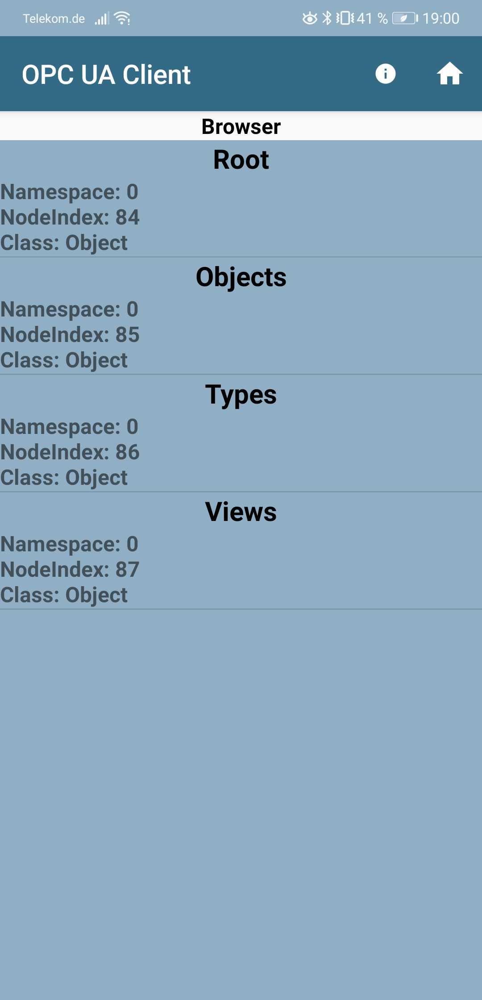

<!--- Cyber Physical Systems
Author: <Max Holzmann>  Date: <2020 11 29> 
Changes by:
<NAME> - <JJJJ MMM DD> - <comment> 

--->
**Cyber Physical Systems**     

Wintersemester 2020/21
***

# Lektion 08: OPC UA Server einrichten und mit Android APP testen
von: Max Holzmann
***

In der Rallye Anwendung wird der OPC UA Server auf dem RallyMaster dafür genutzt, um für jegliche Art von OPC Client relevante Werte aus dem RallyMaster zu veröffentlichen. Konkret geht es hierbei, um die Anzahl an teilnehmenden RallyESPs, den Namen des aktuell RallyESPs sowie dessen Anzahl an Durchfahrten. 

## Ziele
- Aufsetzen eines einfachen OPC UA Server auf dem Rasberry Pi mit Python
- Auslesen der Nodes Des OPC Server mit einer beliebigen OPC UA App 

## Vorraussetzungen und erforderliches Equipment
- Die Tutorial Lektionen ... \
01: Grundlegende Einstellungen und Installationen  [link](../0010_General_Setup/README.md) \
03: Konfigurieren des WLAN Chips des Raspberry pi als Acesspoint  [link](../0030_Wifi_Acess_Point/README.md) \
04: Node Red installieren  [link](../0040_Node_Red/README.md) \
... müssen erledigt sein
- Hardware
    - 1x Raspberry Pi 3 B
    - 1x Android Smartphone
- Verwendete Software und verwendete Tools in diesem Tutorial
  - OPC UA Cleint for Android [link zu Google Play](https://play.google.com/store/apps/details?id=org.twistedappdeveloper.opcclient&hl=de&gl=US)

## Lösungsschritte
1. Installation der Python Bibliothek für OPC UA [link to Git Repository](https://github.com/FreeOpcUa/python-opcua)
    ```console
    pip3 install opcua
    ```
2. Anpassen des *server-minimal.py* Beispiels der Bibliothek für den Rallye OPC UA Server. Zum Datenaustausch von Node Red zum OPC UA Server wird eine json Datei verwendet. In dieser Datei schreibt Node Red jede Sekunde die aktuellen Daten und der OPC Server liest diese anschließend wieder aus.

```python
import sys
sys.path.insert(0, "..")
import time
import json

from opcua import ua, Server


if __name__ == "__main__":

    # setup server
    server = Server()
    server.set_endpoint("opc.tcp://192.168.5.1:4840/rallyopcua/server/")

    # setup namespace
    uri = "http://rally.bayern"
    idx = server.register_namespace(uri)
    print("node index: {}".format(idx))

    # get Objects node
    objects = server.get_objects_node()

    # adddress space with the data nodes
    rallyobj = objects.add_object(idx, "RallyApp")
    numberofcars = rallyobj.add_variable(idx, "NumberOfCars", 0)
    nameofcurrentcar = rallyobj.add_variable(idx, "NameCurrentCar", "test")
    measuremntsofcurrentcar = rallyobj.add_variable(idx, "MeasurenemtsCurrentCar", 0)
    
    # starting!
    server.start()
    
    try:
        while True:
            time.sleep(1)
            try:
                #get the Data from node Red via a json file
                jsonfile = open("/home/pi/rally/opcValues.json", "r")
                jsondata = jsonfile.read()
                #read json conntent
                jsondata = json.loads(jsondata)
                jsonfile.close()
                #set datanodes of OPC UA Server
                numberofcars.set_value(jsondata["numberOfCars"])
                nameofcurrentcar.set_value(jsondata["currentCarName"])
                measuremntsofcurrentcar.set_value(jsondata["currentCarMeasurements"])
            except:
                pass
    finally:
        #close connection, remove subcsriptions, etc
        server.stop()
```
3. Installieren der Android App *OPC UA Client* aus dem [Play Store](https://play.google.com/store/apps/details?id=org.twistedappdeveloper.opcclient&hl=de&gl=US).

4. Verbinden des Smartphones mit dem WLAN Acesspoint des Rallye Masters

5. Der Bilderschritt-Anleitung folgen, um die Werte des Rallye OPC UA Servers lesen zu können.

  

  

  

  


## Quellen

[1] [FreeOpcUa](https://github.com/FreeOpcUa/python-opcua)

[2] [OPC Foundation](https://opcfoundation.org/)
