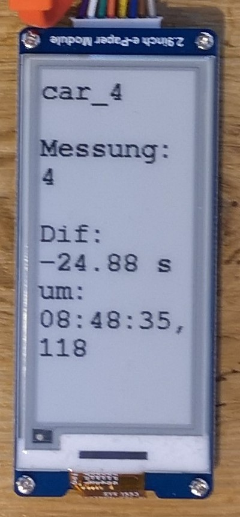

<!--- Cyber Physical Systems
Author: <Max Holzmann>  Date: <2020 11 29> 
Changes by:
<NAME> - <JJJJ MMM DD> - <comment> 

--->
**Cyber Physical Systems**     

Wintersemester 2020/21
***

# Lektion 09: E-paper als Visualisierung der Ergebnisse am RallyESP
von: Max Holzmann
***

Das E-Paper Display ist an den RallyESP angeschlossen und visualisiert die Messergebnisse der Durchfahrten für den Fahrer. Es wird die E-paper-Technologie verwendet, da diese auch bei Sonneneinstrahlung gut lesbar ist.

## Ziele
- Anschließen des E-Paper Displays an den ESP32 über SPI

  


## Voraussetzungen und erforderliches Equipment
- Die Tutorial Lektion 01: Grundlegende Einstellungen und Installationen muss erledigt sein [link](../0010_General_Setup/README.md)
- Hardware
    - 1x ESP DevKitC
    - 1x Waveshare 2.9inch e-Paper Module

## Lösungsschritte mit der Arduino IDE
1. Installation der Adafruit GFX Library und allen erforderlichen Bibliotheken [Link zum Github Repo](https://github.com/adafruit/Adafruit-GFX-Library)

2. Testen des Beispiels durch Kompilieren, Flashen und Auführen.[Link zur Beispieldatei](00_Code/01_E_Paper_2_9_Example_Arduino_IDE/01_E_Paper_2_9_Example_Arduino_IDE.ino)


## Further Inputs

Hier die wichtigsten Zeilen des Beispiels: 

```c++
#include <GxEPD.h>
#include <GxGDEH029A1/GxGDEH029A1.h>      // 2.9" b/w
#include <GxIO/GxIO_SPI/GxIO_SPI.h>
#include <GxIO/GxIO.h>
//Fonts
#include <Fonts/FreeMonoBold9pt7b.h>
#include <Fonts/FreeMonoBold12pt7b.h>

GxIO_Class io(SPI, /*CS=5*/ SS, /*DC=*/ 17, /*RST=*/ 16);
GxEPD_Class display(io, /*RST=*/ 16, /*BUSY=*/ 4); 
...

display.init();
display.eraseDisplay();
display.fillScreen(GxEPD_WHITE);
display.setTextColor(GxEPD_BLACK);
display.setFont(FreeMonoBold12pt7b);
display.setCursor(0, 0);
display.print("Auto: ");
display.println(1);
display.update();
...
```

## Quellen

[1] [Waveshare](https://www.waveshare.com/wiki/2.9inch_e-Paper_Module)

[2] [Adafruit GFX Github Repo](https://github.com/adafruit/Adafruit-GFX-Library)


